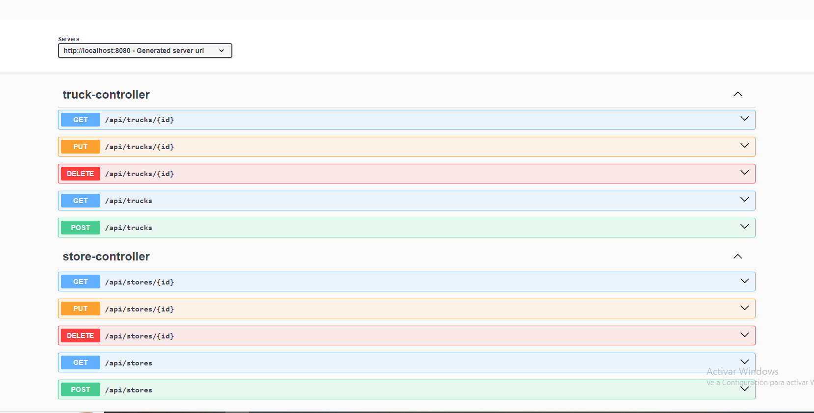

# backend_HAWA

Tecnologías Utilizadas
El backend de la aplicación para la gestión de pedidos de camionetas HAWA está desarrollado utilizando las siguientes tecnologías:

Java 17: Lenguaje de programación principal utilizado para construir la lógica de negocio del backend.
Spring Boot 3.3.1: Framework de Java que simplifica el desarrollo de aplicaciones empresariales basadas en Spring. Facilita la creación de aplicaciones independientes, productivas y listas para producción.
Spring Data JPA: Proporciona abstracciones de alto nivel sobre la persistencia de datos, utilizando Hibernate como proveedor de JPA para interactuar con la base de datos SQL Server.
SQL Server: Sistema de gestión de bases de datos relacionales utilizado para almacenar y gestionar los datos de la aplicación.
Docker: Plataforma de contenedorización utilizada para empaquetar la aplicación y sus dependencias en contenedores, lo que facilita su despliegue y escalabilidad.
Gradle: Herramienta de automatización de la construcción utilizada para compilar y gestionar dependencias del proyecto.
Swagger: Herramienta de documentación y prueba de APIs que permite visualizar y probar los endpoints expuestos por el backend de manera interactiva.
Descripción del Proyecto
El backend está diseñado para gestionar los pedidos de camionetas HAWA, incluyendo las entidades relacionadas como clientes, vendedores, tiendas y camiones. La aplicación permite realizar operaciones CRUD (Crear, Leer, Actualizar, Eliminar) sobre estas entidades, facilitando una gestión completa y eficiente de los pedidos.

Entidades Principales
Usuario (app_user): Representa a los usuarios de la aplicación, con roles como 'ADMIN' y 'USER'.
Cliente (customer): Información de los clientes que realizan pedidos.
Camioneta (truck): Detalles de las camionetas HAWA disponibles para pedido, incluyendo modelo, nombre, precio, descuento y stock.
Tienda (store): Información de las tiendas donde se venden las camionetas.
Vendedor (seller): Información de los vendedores asociados a las tiendas.
Pedido (orders): Detalles de los pedidos realizados por los clientes, incluyendo fecha de pedido, estado, precio total y relaciones con cliente, vendedor y tienda.
Pedidos de Camionetas (orders_trucks): Asociación entre pedidos y camionetas.
Endpoints
El backend expone varios endpoints para interactuar con las entidades descritas anteriormente. Estos endpoints están documentados y pueden ser consultados y probados desde la interfaz de Swagger disponible en la ruta /swagger-ui.html.

Visualización de Endpoints
La aplicación incluye una interfaz Swagger que permite a los usuarios visualizar y probar los endpoints de manera interactiva. La documentación generada automáticamente facilita la comprensión de las operaciones disponibles y los datos necesarios para cada solicitud.

Para acceder a la documentación de Swagger, navegue a la siguiente URL:

bash
Copiar código
http://localhost:8080/swagger-ui.html

Desde esta interfaz, puede explorar y realizar pruebas en los endpoints proporcionados, como se muestra en la imagen adjunta.